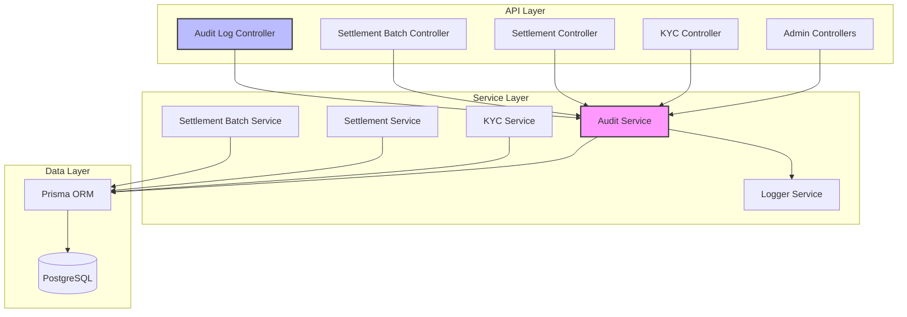
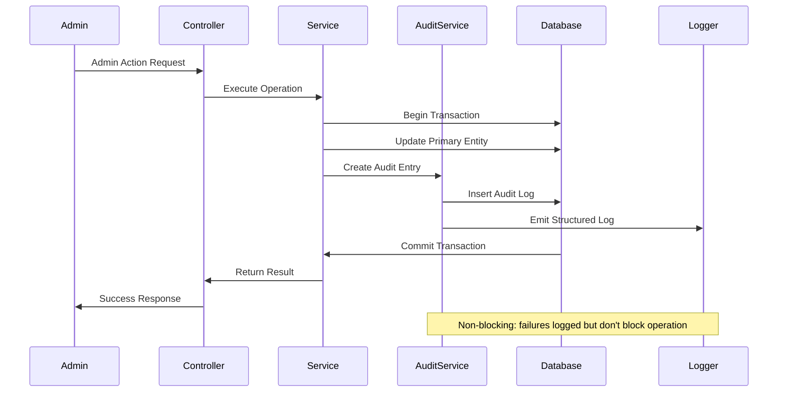

# Design Document: Admin Audit Logging

## Overview

The Admin Audit Logging feature provides comprehensive tracking of administrative actions within the FluxaPay backend system. This design implements a robust audit trail system that captures KYC decisions, configuration changes, sweep triggers, and settlement batch operations while maintaining data integrity and query performance.

The system follows a service-oriented architecture pattern consistent with the existing FluxaPay backend, using Prisma ORM for database access, Express.js for API routing, and structured logging for operational visibility. The audit service integrates seamlessly with existing controllers through a non-blocking capture mechanism that ensures primary operations are not impacted by logging failures.

Key design principles:
- **Non-blocking**: Audit logging failures do not block primary operations
- **Immutable**: Audit entries cannot be modified after creation
- **Queryable**: Efficient filtering and pagination for compliance investigations
- **Structured**: Consistent JSON format for both database storage and log output
- **Secure**: Admin-only access with JWT authentication and API key authorization

## Architecture

### System Components



### Integration Points

The audit service integrates with existing FluxaPay components at the following points:

1. **KYC Controller** (`kyc.controller.ts`)
   - Captures approval/rejection decisions in `updateKycStatus` endpoint
   - Logs within the same transaction as KYC status updates

2. **Settlement Batch Service** (`settlementBatch.service.ts`)
   - Captures batch initiation when admin triggers settlement
   - Updates audit entry on batch completion or failure

3. **Configuration Management** (future integration)
   - Captures system configuration changes
   - Logs previous and new values with sensitive data redaction

4. **Sweep Operations** (future integration)
   - Captures manual sweep triggers
   - Updates audit entry with completion status and statistics

### Data Flow



## Components and Interfaces

### Audit Service

**File**: `fluxapay_backend/src/services/audit.service.ts`

The audit service provides a centralized interface for creating and querying audit log entries.

#### Core Methods

```typescript
interface AuditService {
  // Create audit entry for KYC operations
  logKycDecision(params: {
    adminId: string;
    merchantId: string;
    action: 'approve' | 'reject';
    previousStatus: KYCStatus;
    newStatus: KYCStatus;
    reason?: string;
  }): Promise<AuditLog>;

  // Create audit entry for configuration changes
  logConfigChange(params: {
    adminId: string;
    configKey: string;
    previousValue: string;
    newValue: string;
  }): Promise<AuditLog>;

  // Create audit entry for sweep triggers
  logSweepTrigger(params: {
    adminId: string;
    sweepType: string;
    reason: string;
  }): Promise<AuditLog>;

  // Update sweep audit entry with completion status
  updateSweepCompletion(params: {
    auditLogId: string;
    status: 'completed' | 'failed';
    statistics?: object;
    failureReason?: string;
  }): Promise<AuditLog>;

  // Create audit entry for settlement batch operations
  logSettlementBatch(params: {
    adminId: string;
    batchId: string;
    reason: string;
  }): Promise<AuditLog>;

  // Update settlement batch audit entry with completion status
  updateSettlementBatchCompletion(params: {
    auditLogId: string;
    status: 'completed' | 'failed';
    transactionCount?: number;
    totalAmount?: number;
    failureReason?: string;
  }): Promise<AuditLog>;

  // Query audit logs with filters
  queryAuditLogs(params: {
    dateFrom?: Date;
    dateTo?: Date;
    adminId?: string;
    actionType?: AuditActionType;
    entityId?: string;
    page?: number;
    limit?: number;
  }): Promise<{
    logs: AuditLog[];
    pagination: PaginationInfo;
  }>;
}
```

#### Error Handling Strategy

The audit service implements a fail-safe pattern:

1. **Try-Catch Wrapper**: All audit operations wrapped in try-catch blocks
2. **Structured Error Logging**: Failures logged with full context
3. **Metric Emission**: Failed audit attempts tracked for monitoring
4. **Retry Logic**: Exponential backoff retry (3 attempts) for transient failures
5. **Non-Blocking**: Primary operations proceed even if audit logging fails

```typescript
async function safeAuditLog<T>(
  operation: () => Promise<T>,
  context: string
): Promise<T | null> {
  let attempts = 0;
  const maxAttempts = 3;
  
  while (attempts < maxAttempts) {
    try {
      return await operation();
    } catch (error) {
      attempts++;
      logger.error('Audit log failure', {
        context,
        attempt: attempts,
        error: error.message,
      });
      
      if (attempts < maxAttempts) {
        await delay(Math.pow(2, attempts) * 100); // Exponential backoff
      }
    }
  }
  
  // Emit metric for monitoring
  metrics.increment('audit_log_failure', { context });
  return null;
}
```

### Audit Log Controller

**File**: `fluxapay_backend/src/controllers/audit.controller.ts`

Provides REST API endpoints for querying audit logs.

#### Endpoints

```typescript
// GET /api/admin/audit-logs
// Query audit logs with filters
async function getAuditLogs(req: AuthRequest, res: Response) {
  const {
    date_from,
    date_to,
    admin_id,
    action_type,
    entity_id,
    page = 1,
    limit = 50,
  } = req.query;

  // Validate and parse query parameters
  // Call audit service queryAuditLogs
  // Return paginated results
}

// GET /api/admin/audit-logs/:id
// Get specific audit log entry
async function getAuditLogById(req: AuthRequest, res: Response) {
  const { id } = req.params;
  
  // Fetch audit log by ID
  // Return full audit entry details
}
```

### Audit Log Routes

**File**: `fluxapay_backend/src/routes/audit.route.ts`

```typescript
import { Router } from 'express';
import { authenticateToken } from '../middleware/auth.middleware';
import { authorizeAdmin } from '../middleware/admin.middleware';
import { getAuditLogs, getAuditLogById } from '../controllers/audit.controller';

const router = Router();

// All audit log routes require authentication and admin authorization
router.use(authenticateToken);
router.use(authorizeAdmin);

router.get('/audit-logs', getAuditLogs);
router.get('/audit-logs/:id', getAuditLogById);

export default router;
```

### Structured Logger Integration

The audit service emits structured logs for each audit entry creation, enabling integration with existing monitoring infrastructure.

```typescript
interface StructuredAuditLog {
  level: 'info' | 'warn';
  message: string;
  timestamp: string;
  audit_log_id: string;
  admin_id: string;
  action_type: string;
  entity_type: string;
  entity_id: string;
  details: object;
}

function emitStructuredLog(auditLog: AuditLog, success: boolean) {
  logger.log({
    level: success ? 'info' : 'warn',
    message: `Audit: ${auditLog.action_type}`,
    timestamp: auditLog.created_at.toISOString(),
    audit_log_id: auditLog.id,
    admin_id: auditLog.admin_id,
    action_type: auditLog.action_type,
    entity_type: auditLog.entity_type,
    entity_id: auditLog.entity_id,
    details: auditLog.details,
  });
}
```

## Data Models

### AuditLog Prisma Model

Add to `fluxapay_backend/prisma/schema.prisma`:

```prisma
model AuditLog {
  id          String          @id @default(cuid())
  admin_id    String
  action_type AuditActionType
  entity_type AuditEntityType
  entity_id   String
  details     Json
  created_at  DateTime        @default(now())

  @@index([created_at])
  @@index([admin_id])
  @@index([action_type])
  @@index([entity_id])
  @@index([entity_type, entity_id])
}

enum AuditActionType {
  kyc_approve
  kyc_reject
  config_change
  sweep_trigger
  sweep_complete
  sweep_fail
  settlement_batch_initiate
  settlement_batch_complete
  settlement_batch_fail
}

enum AuditEntityType {
  merchant_kyc
  system_config
  sweep_operation
  settlement_batch
}
```

### Details Field Structure

The `details` JSON field contains action-specific information:

#### KYC Decision Details

```typescript
interface KycDecisionDetails {
  merchant_id: string;
  previous_status: KYCStatus;
  new_status: KYCStatus;
  reason?: string;
  reviewed_at: string;
}
```

#### Configuration Change Details

```typescript
interface ConfigChangeDetails {
  config_key: string;
  previous_value: string; // Redacted if sensitive
  new_value: string;      // Redacted if sensitive
  is_sensitive: boolean;
}
```

#### Sweep Operation Details

```typescript
interface SweepOperationDetails {
  sweep_type: string;
  trigger_reason: string;
  status?: 'completed' | 'failed';
  statistics?: {
    addresses_swept: number;
    total_amount: string;
    transaction_hash?: string;
  };
  failure_reason?: string;
}
```

#### Settlement Batch Details

```typescript
interface SettlementBatchDetails {
  batch_id: string;
  initiation_reason: string;
  status?: 'completed' | 'failed';
  transaction_count?: number;
  total_amount?: number;
  currency?: string;
  completed_at?: string;
  failure_reason?: string;
}
```

### TypeScript Interfaces

**File**: `fluxapay_backend/src/types/audit.types.ts`

```typescript
import { AuditActionType, AuditEntityType } from '../generated/client/client';

export interface AuditLog {
  id: string;
  admin_id: string;
  action_type: AuditActionType;
  entity_type: AuditEntityType;
  entity_id: string;
  details: Record<string, any>;
  created_at: Date;
}

export interface CreateAuditLogParams {
  admin_id: string;
  action_type: AuditActionType;
  entity_type: AuditEntityType;
  entity_id: string;
  details: Record<string, any>;
}

export interface QueryAuditLogsParams {
  dateFrom?: Date;
  dateTo?: Date;
  adminId?: string;
  actionType?: AuditActionType;
  entityId?: string;
  page?: number;
  limit?: number;
}

export interface PaginationInfo {
  total: number;
  page: number;
  limit: number;
  totalPages: number;
}
```


## Correctness Properties

*A property is a characteristic or behavior that should hold true across all valid executions of a system—essentially, a formal statement about what the system should do. Properties serve as the bridge between human-readable specifications and machine-verifiable correctness guarantees.*

### Property Reflection

After analyzing all acceptance criteria, several properties can be consolidated to eliminate redundancy:

- Properties 1.1 and 1.2 (KYC approve/reject) can be combined into a single property about KYC decision logging
- Properties 3.2 and 3.3 (sweep completion/failure) can be combined into a property about sweep status updates
- Properties 4.2 and 4.3 (settlement batch completion/failure) can be combined into a property about batch status updates
- Properties 6.1-6.4 (various filters) can be combined into a comprehensive filtering property
- Properties 7.1 and 7.2 (authentication and authorization) can be combined into a single access control property
- Properties 8.3 and 8.4 (log levels) can be combined into a property about log level assignment
- Properties 10.1 and 10.2 (error logging and metrics) can be combined into a property about failure handling

### Property 1: KYC Decision Audit Completeness

*For any* KYC decision (approval or rejection), the audit system should create an audit entry containing the admin identifier, timestamp, merchant identifier, action type, previous KYC status, new KYC status, and decision reason.

**Validates: Requirements 1.1, 1.2, 1.4**

### Property 2: KYC Decision Transactional Integrity

*For any* KYC status update operation, the audit entry creation and KYC status update should either both succeed or both fail within the same database transaction.

**Validates: Requirements 1.3**

### Property 3: Configuration Change Audit Completeness

*For any* system configuration modification, the audit system should create an audit entry containing the admin identifier, timestamp, configuration key, previous value, and new value.

**Validates: Requirements 2.1**

### Property 4: Configuration Change Transactional Integrity

*For any* configuration update operation, the audit entry creation and configuration update should either both succeed or both fail within the same database transaction.

**Validates: Requirements 2.2**

### Property 5: Sensitive Data Redaction

*For any* configuration change where the configuration is marked as sensitive, the audit entry should contain the configuration key and timestamp but the values should be redacted (replaced with a mask like "***REDACTED***").

**Validates: Requirements 2.3**

### Property 6: Sweep Trigger Audit Completeness

*For any* sweep operation trigger, the audit system should create an audit entry containing the admin identifier, timestamp, sweep type, and trigger reason.

**Validates: Requirements 3.1**

### Property 7: Sweep Status Update Completeness

*For any* sweep operation that completes or fails, the corresponding audit entry should be updated with the completion status, and if completed should include summary statistics, or if failed should include the failure reason.

**Validates: Requirements 3.2, 3.3**

### Property 8: Settlement Batch Initiation Audit Completeness

*For any* settlement batch initiation, the audit system should create an audit entry containing the admin identifier, timestamp, batch identifier, and initiation reason.

**Validates: Requirements 4.1**

### Property 9: Settlement Batch Status Update Completeness

*For any* settlement batch that completes or fails, the corresponding audit entry should be updated with the completion timestamp and status, and if completed should include transaction count and total amount, or if failed should include failure reason and partial statistics.

**Validates: Requirements 4.2, 4.3**

### Property 10: Audit Entry Structure Completeness

*For any* audit entry created, it should contain a unique identifier, creation timestamp, admin identifier, action type, entity type, entity identifier, and action details (non-null).

**Validates: Requirements 5.3**

### Property 11: Audit Entry Immutability

*For any* audit entry created, attempts to modify fields other than allowed status updates (sweep completion, batch completion) should either be prevented or should not affect the stored record.

**Validates: Requirements 5.2**

### Property 12: Date Range Filtering Accuracy

*For any* query with a date range filter, all returned audit entries should have creation timestamps within the specified range (inclusive), and no entries outside the range should be returned.

**Validates: Requirements 6.1**

### Property 13: Multi-Filter Query Accuracy

*For any* query with filters (admin ID, action type, entity ID), all returned audit entries should match all specified filter criteria, and no entries that don't match should be returned.

**Validates: Requirements 6.2, 6.3, 6.4**

### Property 14: Pagination Correctness

*For any* paginated query with page number N and page size S, the returned results should contain at most S entries, should be the correct subset of the total result set (entries from index (N-1)*S to N*S-1), and pagination metadata should accurately reflect total count and page count.

**Validates: Requirements 6.5**

### Property 15: Default Sort Order

*For any* audit log query without explicit sort parameters, the returned entries should be ordered by creation timestamp in descending order (newest first).

**Validates: Requirements 6.6**

### Property 16: Access Control Enforcement

*For any* request to retrieve audit entries, if the request lacks valid JWT authentication or the authenticated user lacks administrative privileges, the request should be rejected with an appropriate error (401 for authentication failure, 403 for authorization failure).

**Validates: Requirements 7.1, 7.2, 7.3, 7.4**

### Property 17: Structured Log Emission

*For any* audit entry created, a structured log entry should be emitted containing the same information (audit log ID, admin ID, action type, entity type, entity ID, details) in valid JSON format with consistent field names.

**Validates: Requirements 8.1, 8.2**

### Property 18: Log Level Assignment

*For any* audit operation, the emitted structured log should have level "info" if the operation succeeded, or level "warn" if the operation failed.

**Validates: Requirements 8.3, 8.4**

### Property 19: Audit Failure Handling

*For any* audit entry creation failure, the system should emit a structured error log and increment a failure metric, without blocking the primary operation.

**Validates: Requirements 10.1, 10.2, 10.3**

### Property 20: Retry Logic

*For any* transient audit entry creation failure, the system should retry the operation up to 3 times with exponential backoff delays (100ms, 200ms, 400ms) before giving up.

**Validates: Requirements 10.4**


## Error Handling

### Error Categories

The audit logging system handles errors in three categories:

#### 1. Database Errors

**Scenarios**:
- Connection failures
- Transaction deadlocks
- Constraint violations
- Query timeouts

**Handling Strategy**:
```typescript
try {
  await prisma.auditLog.create({ data: auditData });
} catch (error) {
  if (error.code === 'P2002') {
    // Unique constraint violation - log and continue
    logger.error('Audit log duplicate entry', { auditData });
  } else if (error.code === 'P2024') {
    // Connection timeout - retry with backoff
    return await retryWithBackoff(() => 
      prisma.auditLog.create({ data: auditData })
    );
  } else {
    // Unknown database error - log and emit metric
    logger.error('Audit log database error', { error, auditData });
    metrics.increment('audit_db_error');
  }
  return null; // Non-blocking: return null on failure
}
```

#### 2. Validation Errors

**Scenarios**:
- Missing required fields
- Invalid enum values
- Malformed JSON in details field

**Handling Strategy**:
```typescript
function validateAuditLogParams(params: CreateAuditLogParams): void {
  if (!params.admin_id) {
    throw new Error('admin_id is required for audit logging');
  }
  if (!Object.values(AuditActionType).includes(params.action_type)) {
    throw new Error(`Invalid action_type: ${params.action_type}`);
  }
  // Additional validations...
}

// In service method:
try {
  validateAuditLogParams(params);
  await createAuditLog(params);
} catch (error) {
  logger.error('Audit log validation error', { error, params });
  metrics.increment('audit_validation_error');
  return null; // Non-blocking
}
```

#### 3. System Errors

**Scenarios**:
- Out of memory
- Disk full
- Logger service unavailable

**Handling Strategy**:
```typescript
try {
  const auditLog = await createAuditLog(params);
  await emitStructuredLog(auditLog); // May fail if logger unavailable
} catch (error) {
  // Log to stderr as fallback
  console.error('Critical audit system error:', error);
  metrics.increment('audit_system_error');
  // Primary operation continues regardless
}
```

### Transaction Handling

For operations that require transactional integrity (KYC decisions, config changes), the audit service accepts a Prisma transaction client:

```typescript
async function logKycDecisionWithTransaction(
  params: KycDecisionParams,
  tx: Prisma.TransactionClient
): Promise<AuditLog> {
  return await tx.auditLog.create({
    data: {
      admin_id: params.adminId,
      action_type: params.action === 'approve' ? 'kyc_approve' : 'kyc_reject',
      entity_type: 'merchant_kyc',
      entity_id: params.merchantId,
      details: {
        merchant_id: params.merchantId,
        previous_status: params.previousStatus,
        new_status: params.newStatus,
        reason: params.reason,
        reviewed_at: new Date().toISOString(),
      },
    },
  });
}

// Usage in KYC service:
await prisma.$transaction(async (tx) => {
  // Update KYC status
  const updatedKyc = await tx.merchantKYC.update({
    where: { merchantId },
    data: { kyc_status: newStatus, reviewed_by: adminId },
  });
  
  // Create audit log in same transaction
  await logKycDecisionWithTransaction({
    adminId,
    merchantId,
    action: 'approve',
    previousStatus: oldStatus,
    newStatus,
    reason,
  }, tx);
  
  return updatedKyc;
});
```

### Error Response Format

API endpoints return consistent error responses:

```typescript
interface ErrorResponse {
  success: false;
  error: {
    code: string;
    message: string;
    details?: object;
  };
}

// Example error responses:
{
  "success": false,
  "error": {
    "code": "UNAUTHORIZED",
    "message": "Invalid or expired JWT token"
  }
}

{
  "success": false,
  "error": {
    "code": "FORBIDDEN",
    "message": "Admin privileges required"
  }
}

{
  "success": false,
  "error": {
    "code": "VALIDATION_ERROR",
    "message": "Invalid date range",
    "details": {
      "date_from": "Must be before date_to"
    }
  }
}
```

## Testing Strategy

### Dual Testing Approach

The audit logging feature requires both unit tests and property-based tests for comprehensive coverage:

- **Unit tests**: Verify specific examples, edge cases, and error conditions
- **Property tests**: Verify universal properties across all inputs

Both testing approaches are complementary and necessary. Unit tests catch concrete bugs in specific scenarios, while property tests verify general correctness across a wide range of inputs.

### Property-Based Testing

**Library**: [fast-check](https://github.com/dubzzz/fast-check) for TypeScript/Node.js

**Configuration**: Each property test should run a minimum of 100 iterations to ensure adequate randomization coverage.

**Test Structure**:

```typescript
import fc from 'fast-check';
import { describe, it, expect } from '@jest/globals';

describe('Audit Logging Properties', () => {
  it('Property 1: KYC Decision Audit Completeness', async () => {
    // Feature: admin-audit-logging, Property 1: For any KYC decision, 
    // audit entry contains all required fields
    
    await fc.assert(
      fc.asyncProperty(
        fc.record({
          adminId: fc.uuid(),
          merchantId: fc.uuid(),
          action: fc.constantFrom('approve', 'reject'),
          previousStatus: fc.constantFrom('not_submitted', 'pending_review'),
          newStatus: fc.constantFrom('approved', 'rejected'),
          reason: fc.string({ minLength: 10, maxLength: 200 }),
        }),
        async (params) => {
          const auditLog = await auditService.logKycDecision(params);
          
          expect(auditLog.admin_id).toBe(params.adminId);
          expect(auditLog.entity_id).toBe(params.merchantId);
          expect(auditLog.action_type).toMatch(/^kyc_(approve|reject)$/);
          expect(auditLog.details.previous_status).toBe(params.previousStatus);
          expect(auditLog.details.new_status).toBe(params.newStatus);
          expect(auditLog.details.reason).toBe(params.reason);
          expect(auditLog.created_at).toBeInstanceOf(Date);
        }
      ),
      { numRuns: 100 }
    );
  });

  it('Property 13: Multi-Filter Query Accuracy', async () => {
    // Feature: admin-audit-logging, Property 13: Filtered queries return 
    // only matching entries
    
    await fc.assert(
      fc.asyncProperty(
        fc.array(
          fc.record({
            adminId: fc.uuid(),
            actionType: fc.constantFrom(
              'kyc_approve', 'kyc_reject', 'config_change'
            ),
            entityId: fc.uuid(),
          }),
          { minLength: 10, maxLength: 50 }
        ),
        fc.record({
          adminId: fc.option(fc.uuid(), { nil: undefined }),
          actionType: fc.option(
            fc.constantFrom('kyc_approve', 'kyc_reject'),
            { nil: undefined }
          ),
        }),
        async (auditEntries, filters) => {
          // Create audit entries
          for (const entry of auditEntries) {
            await createTestAuditEntry(entry);
          }
          
          // Query with filters
          const result = await auditService.queryAuditLogs(filters);
          
          // Verify all returned entries match filters
          for (const log of result.logs) {
            if (filters.adminId) {
              expect(log.admin_id).toBe(filters.adminId);
            }
            if (filters.actionType) {
              expect(log.action_type).toBe(filters.actionType);
            }
          }
          
          // Verify no matching entries were excluded
          const matchingCount = auditEntries.filter(e => 
            (!filters.adminId || e.adminId === filters.adminId) &&
            (!filters.actionType || e.actionType === filters.actionType)
          ).length;
          
          expect(result.logs.length).toBe(matchingCount);
        }
      ),
      { numRuns: 100 }
    );
  });
});
```

### Unit Testing

Unit tests focus on specific scenarios, edge cases, and integration points:

```typescript
describe('Audit Service Unit Tests', () => {
  describe('KYC Decision Logging', () => {
    it('should create audit entry for KYC approval', async () => {
      const params = {
        adminId: 'admin-123',
        merchantId: 'merchant-456',
        action: 'approve' as const,
        previousStatus: 'pending_review' as KYCStatus,
        newStatus: 'approved' as KYCStatus,
        reason: 'All documents verified',
      };
      
      const auditLog = await auditService.logKycDecision(params);
      
      expect(auditLog.id).toBeDefined();
      expect(auditLog.action_type).toBe('kyc_approve');
      expect(auditLog.entity_type).toBe('merchant_kyc');
    });
    
    it('should handle missing reason gracefully', async () => {
      const params = {
        adminId: 'admin-123',
        merchantId: 'merchant-456',
        action: 'approve' as const,
        previousStatus: 'pending_review' as KYCStatus,
        newStatus: 'approved' as KYCStatus,
        // reason omitted
      };
      
      const auditLog = await auditService.logKycDecision(params);
      
      expect(auditLog.details.reason).toBeUndefined();
    });
  });
  
  describe('Error Handling', () => {
    it('should not throw when audit logging fails', async () => {
      // Mock database failure
      jest.spyOn(prisma.auditLog, 'create').mockRejectedValue(
        new Error('Database connection failed')
      );
      
      // Should not throw
      await expect(
        auditService.logKycDecision(validParams)
      ).resolves.toBeNull();
    });
    
    it('should emit metric on audit failure', async () => {
      const metricsSpy = jest.spyOn(metrics, 'increment');
      jest.spyOn(prisma.auditLog, 'create').mockRejectedValue(
        new Error('Database error')
      );
      
      await auditService.logKycDecision(validParams);
      
      expect(metricsSpy).toHaveBeenCalledWith(
        'audit_log_failure',
        expect.any(Object)
      );
    });
  });
  
  describe('Access Control', () => {
    it('should reject requests without JWT token', async () => {
      const response = await request(app)
        .get('/api/admin/audit-logs')
        .expect(401);
      
      expect(response.body.error.code).toBe('UNAUTHORIZED');
    });
    
    it('should reject requests without admin privileges', async () => {
      const merchantToken = generateMerchantToken('merchant-123');
      
      const response = await request(app)
        .get('/api/admin/audit-logs')
        .set('Authorization', `Bearer ${merchantToken}`)
        .expect(403);
      
      expect(response.body.error.code).toBe('FORBIDDEN');
    });
  });
});
```

### Integration Testing

Integration tests verify the audit system works correctly with real database and other services:

```typescript
describe('Audit Logging Integration Tests', () => {
  beforeEach(async () => {
    await cleanDatabase();
  });
  
  it('should create audit entry within KYC update transaction', async () => {
    // Create merchant with pending KYC
    const merchant = await createTestMerchant();
    await createTestKyc(merchant.id, { status: 'pending_review' });
    
    // Update KYC status (should create audit entry in same transaction)
    await kycService.updateKycStatusService(
      merchant.id,
      { status: 'approved' },
      'admin-123'
    );
    
    // Verify audit entry was created
    const auditLogs = await prisma.auditLog.findMany({
      where: { entity_id: merchant.id },
    });
    
    expect(auditLogs).toHaveLength(1);
    expect(auditLogs[0].action_type).toBe('kyc_approve');
  });
  
  it('should rollback audit entry if KYC update fails', async () => {
    const merchant = await createTestMerchant();
    
    // Simulate KYC update failure
    jest.spyOn(prisma.merchantKYC, 'update').mockRejectedValue(
      new Error('Update failed')
    );
    
    await expect(
      kycService.updateKycStatusService(
        merchant.id,
        { status: 'approved' },
        'admin-123'
      )
    ).rejects.toThrow();
    
    // Verify no audit entry was created
    const auditLogs = await prisma.auditLog.findMany({
      where: { entity_id: merchant.id },
    });
    
    expect(auditLogs).toHaveLength(0);
  });
});
```

### Test Coverage Goals

- **Unit Test Coverage**: Minimum 80% line coverage for audit service and controller
- **Property Test Coverage**: All 20 correctness properties implemented as property-based tests
- **Integration Test Coverage**: All integration points (KYC, settlement batch, config) tested
- **Edge Case Coverage**: Empty results, pagination boundaries, date range edge cases

### Testing Tools

- **Test Framework**: Jest
- **Property Testing**: fast-check
- **API Testing**: supertest
- **Database Testing**: Prisma with test database
- **Mocking**: jest.mock for external dependencies
- **Coverage**: jest --coverage

